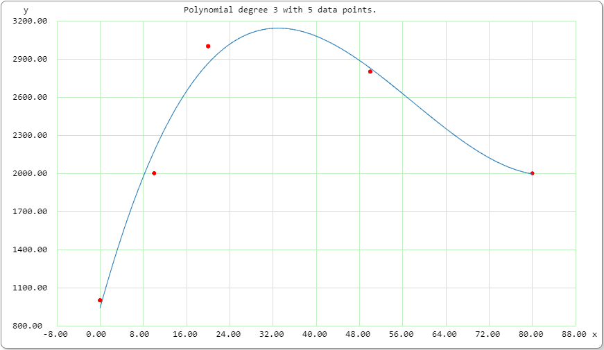

# Polynomial function



```plaintext
Mode: normal x,y analysis
Polynomial degree 3, 4 x,y data pairs.
Correlation coefficient = 1
Standard error = 4.3042218118097663e-11

Output form: mathematical function:

f(x) =  9.9999999999997874e+002 * x^0
     +  5.9151704397609030e-003 * x^1
     + -5.5089670016536930e-009 * x^2
     +  1.3956521653067459e-015 * x^3
```

